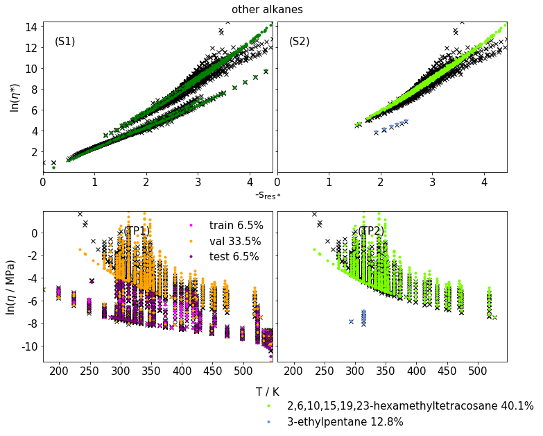
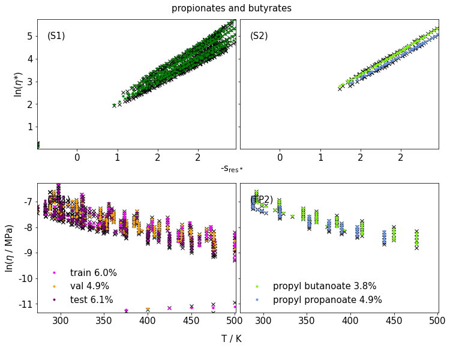

# Deep Entropy Scaling to predict Viscosities

This model approach driven by entropy scaling and deep earning allows to predict viscosities for wide ranges of substances and state points within milliseconds (which was not possible before with the prediction accuracy achieved here).

A [preprint](https://chemrxiv.org/engage/chemrxiv/article-details/66268bc621291e5d1d62b8bf) of the underlying publication is available. For legal reasons, only the implementation of the architecture is available but no trained models.

Integrating entropy scaling into a deep learning architecture to predict viscosities.

Transport properties such as viscsosities show complex behavior in temperature-pressure space (the pressure dimension is not shown in the plot below) including different phases (liquid, gaseous, ...). Training a model in this space is not promising.

Instead we can utilize the univariant relationship between reduced viscosity and residual entropy. The viscosity is reduced though a reference viscosity. We use a modified form of the Chapman-Enskog viscosity as our reference.

A deep learning model that uses the reduced residual entropy space should be quite powerful in predicting viscosities.

Typically, substance-specific polynomials are fitted in the reduced residual entropy space and used for interpolation. There are also group contribution theories. However, these approaches are usually quite limited. Only individual or a few substances of a group can be described well.

Imperfect translation results lead to noise in the reduced residual entropy space. The approach cannot be better than this noise allows. The typical translation losses are less than 5% for alkanes, between 5% and 10% for alcohols and correspondingly higher for more complex molecules and chemical families.

The residual entropy is calculated with the PC-SAFT equation of state. This equation of state is based on parameters that describe the physical properties of molecules. These parameters can be interpreted and have a physical meaning. There are large databases that contain meaningful PC-SAFT parameter sets based on defined rules. PC-SAFT parameters have also been estimated from SMILES strings using deep learning algorithms. PC-SAFT parameters obtained with such algorithms are powerful low dimensional representations of the underlying species.
Hence, these parameter sets should represent the underlying molecules and intermolecular patterns well enough to serve as a meaningful basis for predictions via deep learning.

The PC-SAFT equation of state was developed to describe chain-shaped molecules and therefore its parameters can only represent these. Some cyclic molecules appeared as outliers in tests and were not used in the training of the final model. The fact that cyclic molecules occur as outliers firstly shows the model limits, but secondly also the resulting robustness of the approach (still many cyclic molecules might be covered by the approach because of patterns in the parameters separating them from other molecules).

The entropy scaling approach can be implemented into an NN architecture in the following way:

As you can see, polynomial features of the (minmax normalized) reduced residual entropy are used. The number of polynomial features used is a hyperparameter that is optimized together with the other hyperparameters. All features used in the NN are minmax normalized. The inner NN is fully connected whereas the outer NN architecture incorporates the entropy scaling approach.

The entropy scaling approach was transferred to an NN architecture i.e. the forward and backward pass pass the reduced residual entropy space, so that training is not done in the reduced residual entropy space, but directly on experimental data (i.e. the logarithm of the viscosity / MPas).

The base architecture can be extended to build even better models. For example we can add an additional neural network to correct the Chapman-Enskog reference to obtain a better reference, improved predictive capabilities for the vapor phase and noise reduction in reduced residual entropy space. We end up with two NNs, the para net and the ref net. The number of inner layer blocks of para and ref net are hyperparameters. An inner layer block consists of a linear layer, and layer normalization followed by ReLU activation.

The predictive capabilities of this approach are remarkable (training, validation and test errors around 10%). Please check the demo notebook for deeper insights and a how to apply the model.

The training data comprises around 62000, validation data around 23000 (50% samples of molecules that are not in the training set, 50% random samples of samples from molecules in the training set) and test data around 10000 samples (only data from molecules in the training set to measure the interpolation capabilities).

Hyperparemeters are estimated via random search and early stopping.

* * * * * * * * * *
## Results

All results shown here belong to model0 and part of the corresponding publication. A second model named model_ref0 was trained without any polynomial features (i.e. without para net which means that the entropy space is not utilized, which leads to significantly worse predictions) and model_ref1 without polynomial features that correct non-linearities (i.e. the model is linear) in reduced entropy space with the help of the ref net. These models could be useful for the further development of the theoretical foundation of entropy scaling. Especially with regard to improved reference fluids and the role of densities but is not part of this README.

The MEADs given refer to the differences between the experimental and predicted viscosities. However, the viscosities are shown logarithmically in the diagrams.

The results are broken down by substance family. In the left column you can see predictions for all training, validation and test data for the respective family. Randomly selected species can be seen on the right. All of these species were not used for training, but for validation. So these are predictions.

* * * * * * * * * *

* * * * * * * * * *

* * * * * * * * * *

* * * * * * * * * *

* * * * * * * * * *

* * * * * * * * * *

* * * * * * * * * *

* * * * * * * * * *

* * * * * * * * * *

* * * * * * * * * *

* * * * * * * * * *

* * * * * * * * * *

* * * * * * * * * *

* * * * * * * * * *

* * * * * * * * * *

* * * * * * * * * *

* * * * * * * * * *

* * * * * * * * * *

* * * * * * * * * *

* * * * * * * * * *

* * * * * * * * * *

* * * * * * * * * *

* * * * * * * * * *

* * * * * * * * * *

* * * * * * * * * *

* * * * * * * * * *

* * * * * * * * * *

* * * * * * * * * *

* * * * * * * * * *

* * * * * * * * * *

## Future

- Outputs of a SMILES encoder instead of PC-SAFT parameters should strengthen the approach and allow good predictions for cyclic molecules etc. PC-SAFT would still be used to predict entropies and reference viscosity.
- Other transport properties such as diffusion and thermal conductivity are also accessible via entropy scaling. All three properties could be built into one architecture. Then they could learn from each other because there are functional relationships between them. The existing experimental data could thus be utilised extremely effectively.
- ... read the paper for deeper insights :)

## TO DO

- datamodel DONE
- model itself DONE
- pre proc DONE

- notebook DONE
- comments DONE

- README with theory etc. DONE
- code docstrings

- results
- approx of training space for extra check